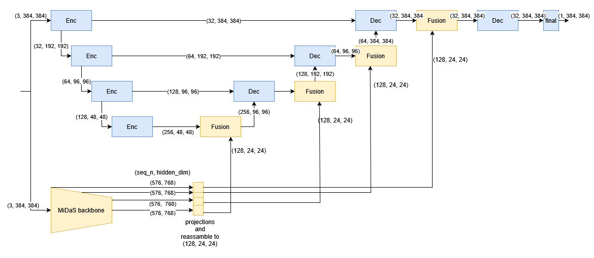
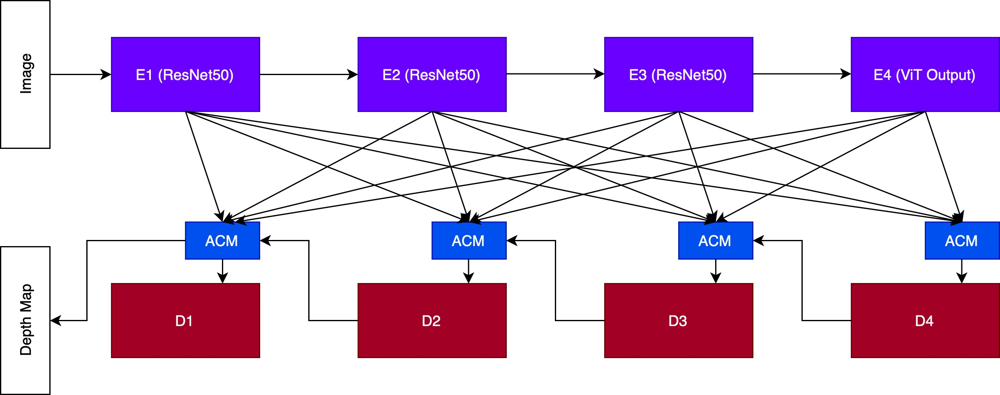
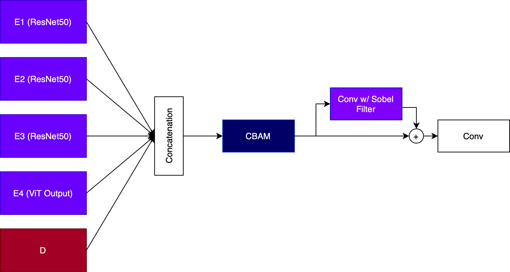

# Monocular Depth Project for CIL, ETH Zurich (Spring 2025)

For the following 5 models the provided example notebook on kaggle has been used as a base and we have mainly adjusted the model definition for the various experiments as well as added a function for the scale-invariant [RMSE loss](https://github.com/TheHummel/cil-monocular-depth/blob/master/training/loss.py). The relevant models can all be found in the [models](https://github.com/TheHummel/cil-monocular-depth/tree/master/models) folder. We now give a short description on each of the models, link to it's definition in code and how to execute them.

**For the review: find links to the lines of code where the model definition is located. Main method, image transforms and training method remain largely unchanged in comparison to the kaggle template**

## Baseline model 1: Basic UNet

The basic Unet is a bigger version of the UNet given in the provided example on kaggle with 4 Encoder, Decoder blocks. The associated file can be found in the models section as [basic_unet.py](https://github.com/TheHummel/cil-monocular-depth/blob/master/models/basic_unet.py) with the model defintion starting on [line 127](https://github.com/TheHummel/cil-monocular-depth/blob/master/models/basic_unet.py#L127-L211). To run the training, simply execute this file.

## Baseline model 2: MiDaS Decoder Finetuned:

This is the pre-trained model from huggingface where we finetuned the decoder on the dataset. We just import the model and disable gradients for the encoder parameters here to only train the decoder. Simply execute the file [finetune_midas_decoder.py](https://github.com/TheHummel/cil-monocular-depth/blob/master/models/finetune_midas_decoder.py) in models to run the training. Model definitions starts on [line 126](https://github.com/TheHummel/cil-monocular-depth/blob/master/models/finetune_midas_decoder.py#L126-L145).

## 1. Variant: UNet with MiDaS-Encoder features:

This model takes a 4 layer UNet as a base and additionaly runs the input through the frozen encoder layer of the MiDaS model and fuses MiDaS features from different encodder stages into the UNet decoder. To run the training, run file [unet_plus_midas_vit.py](https://github.com/TheHummel/cil-monocular-depth/blob/master/models/unet_plus_midas_vit.py). Model definitions is on [line 128](https://github.com/TheHummel/cil-monocular-depth/blob/master/models/unet_plus_midas_vit.py#L128-L271). The following diagram depicts the model architecture to help with understanding. 

## 2. Variant: MiDaS with full skip connection network:

This is inspired by the paper [Rethinking Skip Connections in Encoder-decoder Networks for Monocular Depth Estimation](https://arxiv.org/abs/2208.13441). The implementation replaces the FusionBlocks in the MiDaS Neck layer (model.dpt.neck) with a custom FusionBlock that performs a more complex feature fusion of different encoder hidden_states. For a more precise explanation, see report with related diagrams in the appendix. The model is located in [models/dpt_hybrid_midas](https://github.com/TheHummel/cil-monocular-depth/tree/master/models/dpt_hybrid_midas). To run this model execute the run_midas_fscn located in [slurm_scripts](https://github.com/TheHummel/cil-monocular-depth/blob/master/slurm_scripts/run_midas_fscn.sh). The following figure displays how the encoder stages are connected with the decoder stages via a full skip connection network (FSCN):

The adaptive concatenation module (ACM), consisting of a Convolutional Block Attention Module (CBAM) is used to concatenate the different encoder stages:

## 3. Variant (Combination): UNet with MiDaS-Encoder features and FSCN:

This model is the combination of the two variants, where instead of just adding one hidden_state from the MiDaS encoder into the UNet decoder, we take all selected hidden_states from the MiDaS encoder and combine them before fusing them into the UNet pipeline. The code to train this model is located in [unet_plus_midas_vit_and_fscn.py](https://github.com/TheHummel/cil-monocular-depth/blob/master/models/unet_plus_midas_vit_and_fscn.py) under models. Note that it is too large to run on the student-cluster and has to be run in google colab. Model definitions are located on [line 144](https://github.com/TheHummel/cil-monocular-depth/blob/master/models/unet_plus_midas_vit_and_fscn.py#L144-L380) The following diagram gives a rough overview.

