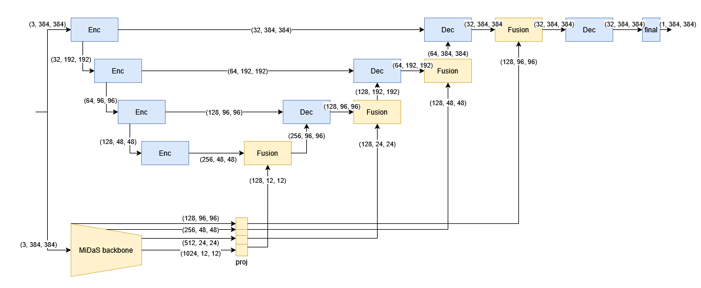
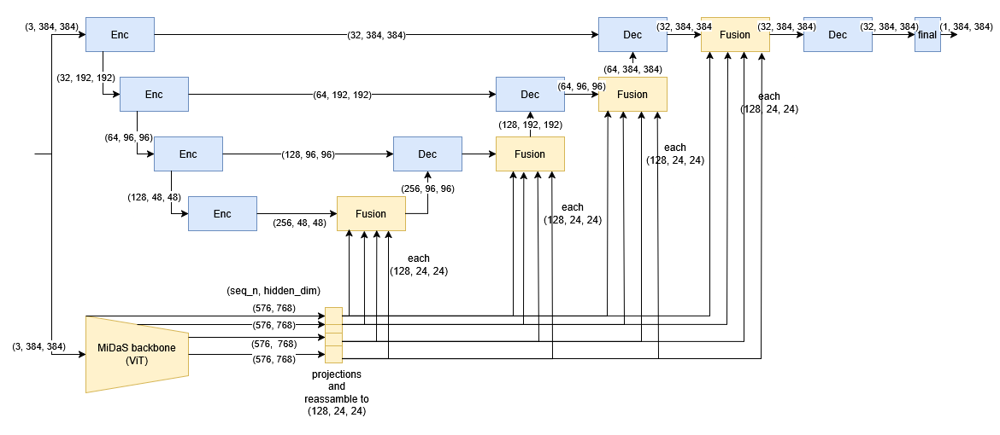

# Monocular Depth Project for CIL, ETH Zurich (Spring 2025)

For the following 5 models the provided example notebook on kaggle has been used as a base and we have mainly adjusted the model definition section as well as added a function for the scale-invariant RMSE loss.

## Baseline model 1: Basic UNet

The basic Unet is a bigger version of the UNet given in the provided example on kaggle with 4 Encoder, Decoder blocks. The associated file can be found in --------.

## Baseline model 2: MiDaS Decoder Finetuned:

This is the pre-trained model from huggingface where we finetuned the decoder on the dataset. In our report we made use of both the MiDaS version with [ViT backbone](https://huggingface.co/Intel/dpt-hybrid-midas) and the [Swinv2 backbone](https://huggingface.co/Intel/dpt-swinv2-base-384). The File to train either option is located at --------.

## Baseline model 3: MiDaS with full skip connection network:

This is inspired by the paper [Rethinking Skip Connections in Encoder-decoder Networks for Monocular Depth Estimation](https://arxiv.org/abs/2208.13441). The implementation replaces the FusionBlocks in the MiDaS Neck layer (model.dpt.neck) with a custom FusionBlock that performs a more complex feature fusion of different encoder hidden_states. The model is located in --------.

## 1. Variant: UNet with MiDaS-Encoder features:

This model takes a 4 layer UNet as a base and additionaly runs the input through the frozen encoder layer of the MiDaS model and fuses MiDaS features from different encodder stages into the UNet decoder. The file used to train this model is located in ------. The following diagram depicts the model architecture.

## 2. Variant: UNet with MiDaS-Encoder features and FSCN:

This model is the combination of Baseline 3 and the 1. Variant, where instead of just adding one hidden_state from the MiDaS encoder into the UNet decoder, we take all selected hidden_states from the MiDaS encoder and combine them before fusing them into the UNet pipeline. The file to train this model is located at -------. The following diagram gives a rough overview.

